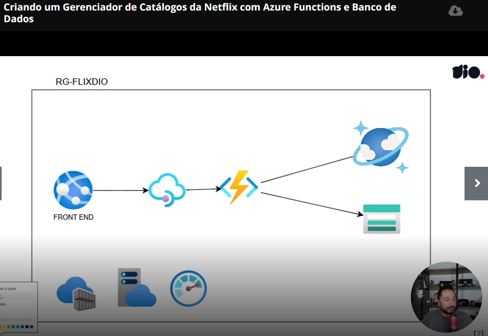
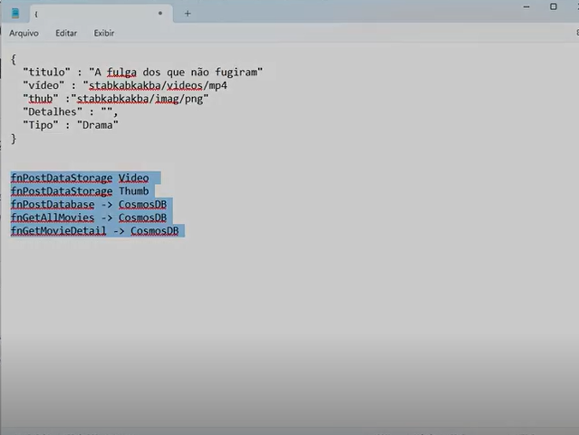
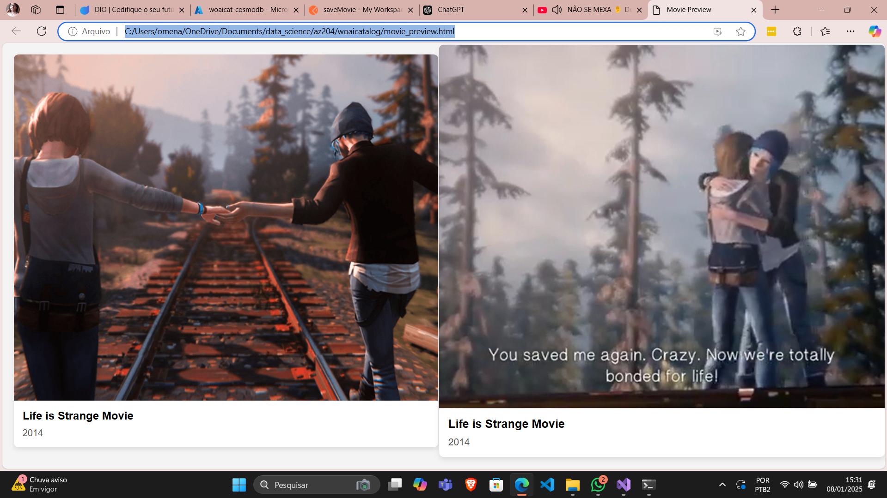

# Azure Project

Este projeto utiliza tecnologias do Azure para implementar uma solução escalável e eficiente, baseada em:
- **Azure Storage**: Armazenamento seguro e escalável de dados.
- **Azure Functions**: Processamento serverless para eventos e lógica de negócios.
- **Azure CosmosDB**: Banco de dados NoSQL de alta performance.

## Estrutura do Projeto

A arquitetura do projeto é apresentada na imagem abaixo:

### Fluxo do Projeto
1. Os dados enviados ao portal (imagens e vídeos) são armazenados no **Azure Storage**.
2. As **Azure Functions** processam os eventos gerados e inserem metadados no **Azure CosmosDB**.
3. A aplicação final consolida os dados, permitindo visualização e interatividade através de uma página web.

## Arquivos Relevantes

### `movies_preview.html`
Página principal da solução, que integra o resultado do projeto. Permite visualizar imagens e vídeos armazenados, com um preview funcional de vídeos (conforme mostrado em `final_project.png`).

### `postmanCollection.json`
Coleção do Postman que documenta e permite a reprodução das requisições utilizadas no projeto.

### `infra_deploy.sh`
Script que automatiza o provisionamento da arquitetura, configurando os serviços necessários no Azure.

## Como Executar

É necessário que a infraestrutura já esteja configurada no Portal Azure, e as devidas conexões de local.settings.json (não providenciadas no repositório) devem ser providenciadas de acordo com o recurso necessário.
Os módulos que utilizam Storage Account precisam da autenticação desse, e o do cosmosDB de sua própria conexão de autenticação.

Depois de providenciar a arquitetura e configurações, pode ser executado localmente com a instalação do Azure Func Core, e da inicialização de cada módulo individualmente.

## Tecnologias Utilizadas
- Azure Storage
- Azure Functions
- Azure CosmosDB
- HTML5
- Shell Script
- Postman